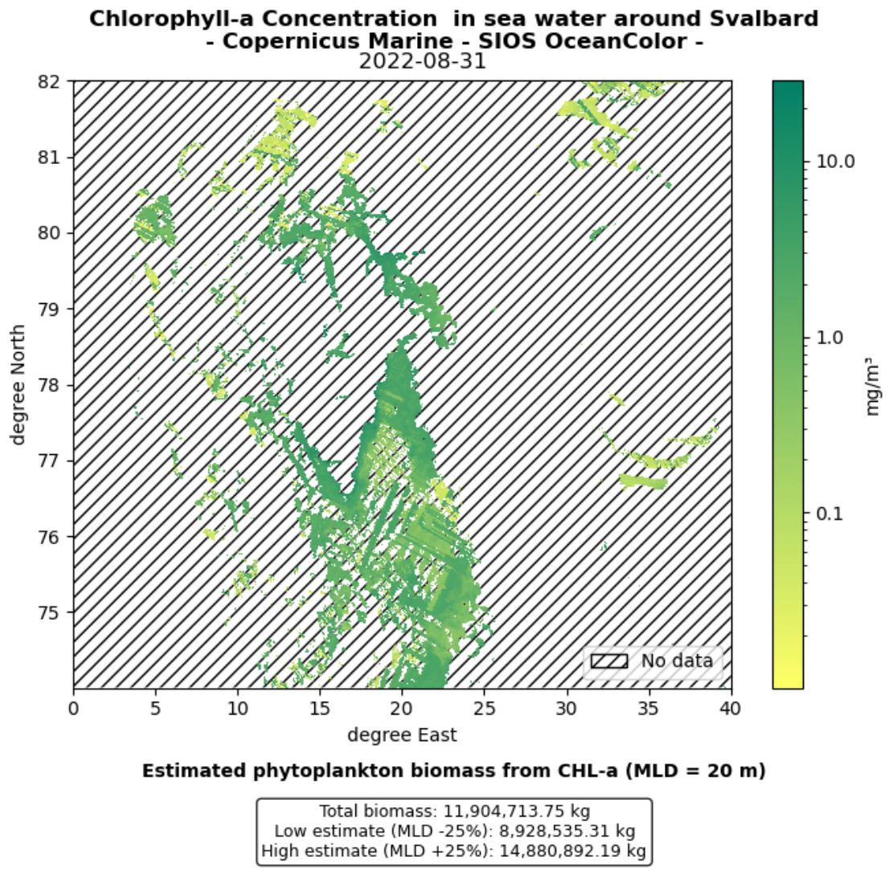

# Estimating Phytoplankton Biomass from OceanColor CHL-a (Svalbard Region)

## ⚠️ Disclaimer

This script is intended for **exploratory and demonstrative purposes only**.  
It estimates phytoplankton biomass by using **Chlorophyll-a (CHL-a)** concentration as a **proxy**, assuming a fixed Mixed Layer Depth (MLD) and no validation against in situ data.

This is a **highly simplified approximation** and does **not reflect realistic Net Primary Production (NPP)**.  
Accurate NPP estimates require additional environmental inputs, such as:

- Sea Surface Temperature (SST)  
- Photosynthetically Active Radiation (PAR)  
- A productivity model (e.g., **VGPM** or **CbPM**)

The dataset used here is derived from the [SIOS InfraNOR OceanColor Arctic 1km product](https://thredds.nersc.no/thredds/catalog/sios_infranor_oceancolor/arctic_1km_oceancolor/catalog.html), which aggregates ocean color observations from sensors such as **Sentinel‑3 OLCI**, **VIIRS**, and **Suomi-NPP**, processed using the **OC-CCI (OC5) algorithm**. It provides CHL-a concentrations, but does **not** include NPP values or other required inputs for true productivity estimates.

> Do **not** use the outputs of this script for operational, ecological, or publication-grade analysis without further model integration and validation.

---

This Python script visualizes and estimates phytoplankton biomass using **CHL-a data** from the OceanColor Arctic 1km product.
It is meant as a demonstration of using CHL-a as a **biomass proxy**, and includes steps for both:
- Plotting CHL-a concentrations on a specific date
- Computing a rough biomass estimate based on a user-defined Mixed Layer Depth (MLD)


## 🌊 Dataset

- Source: Copernicus Marine - OceanColor Arctic 1km
- Format: netCDF4 via OPeNDAP or downloaded `.nc` file
- Variable used: `CHL` (Chlorophyll-a concentration in mg/m³)

## 📊 What the script does
 === PART 1: Load dataset and prepare for plotting ===

1. Load NetCDF
2. Extract lat/lon/CHL/time
3. Handle _FillValue, NaN
4. Mask invalid values → CHL4P
5. Plot CHL4P with log scale
6. Add hatching for missing values
7. Add legend, title, axes

 === PART 2: Biomass estimation ===

1. Define compute_biomass_estimates()  
   Biomass (mg) = CHL-a (mg/m³) × MLD (m) × area (m²)
3. Reuse CHL4P to calculate total biomass
4. Print result to terminal
5. Add biomass text block under plot

## 🗺️ Output Example

The figure below illustrates the spatial distribution of surface Chlorophyll-a concentration around Svalbard, as processed by the script.

<p align="left">
  <a href="Figures/Chl-a_concentration_Svalbard_01.png">
    
  </a>
</p>

## 📁 File

- `CHL-a-Svalbard_v02.00.py`: Main script

## 🔧 Requirements

- Python 3.x
- `numpy`, `matplotlib`, `netCDF4`

Install with:

```bash
pip install numpy matplotlib netCDF4
